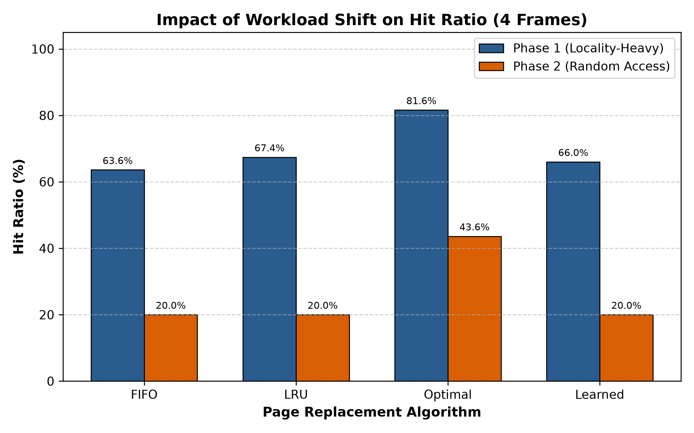

# Learning-Augmented Page Replacement: Classical Algorithms Under Workload Shift

**Course**: CSE-307 Operating Systems  
**Section**: B  
**Student Name**: Mahin Ar Rahman  
**Student ID**: 202414064  
**GitHub Repository**: https://github.com/Mahin13377/OS-Term-Paper  

---

## 1. Problem Framing

In virtual memory systems, the operating system manages memory using fixed-size pages. When a referenced virtual page is not currently mapped to a valid physical frame, the processor raises a page-fault exception and the operating system's page-fault handler responds. The operating system must load the missing page from secondary storage into an available frame. If all frames are occupied, a page-replacement algorithm must select a resident victim page to evict.

Because secondary storage is orders of magnitude slower than main memory, page faults incur severe execution penalties. Classical policies rely on static heuristics: FIFO evicts the oldest resident page, while LRU evicts the page unreferenced for the longest duration.

However, real programs exhibit non-stationary workloads where access patterns shift over time, such as transitioning from tight loops to scanning large datasets or performing random lookups. Under such shifts, classical heuristics can degrade sharply. This paper evaluates FIFO, LRU, Optimal, and a lightweight learning-augmented Decision Tree policy, examining how an abrupt shift from localized to random access affects their performance.

---

## 2. Classical Page-Replacement Algorithms

### 2.1 First-In, First-Out (FIFO)
FIFO tracks resident pages in an arrival queue. On a replacement fault, the page that entered memory earliest is evicted. Although FIFO has minimal bookkeeping overhead, it frequently evicts heavily used pages and can exhibit Belady's Anomaly.

### 2.2 Least Recently Used (LRU)
LRU records the logical access time of each page, evicting the page with the oldest access timestamp. LRU performs well on workloads with strong temporal locality. However, tracking access history adds runtime overhead, and performance declines when working sets exceed frame capacity.

### 2.3 Optimal / Belady's Min Algorithm
Belady's Optimal algorithm establishes the theoretical performance limit for page replacement. When an eviction occurs, Optimal inspects future references and evicts the resident page whose next use is farthest in the future. Because an operating system cannot predict future accesses, Optimal is unimplementable online. Nonetheless, it defines the lowest achievable fault count and serves as an oracle to generate supervision labels for machine learning.

---

## 3. Learned / Adaptive Component

Rather than deploying complex neural networks that introduce prohibitive latency into operating system kernels, this project uses an explainable, lightweight policy based on scikit-learn's DecisionTreeClassifier.

### 3.1 Feature Representation
Whenever a page fault requires an eviction, each candidate page p resident in memory is characterized by three lightweight features:
- **Recency**: Memory accesses elapsed since page p was last referenced (current index - last-used index).
- **Frequency**: References to page p within a sliding window of the last W = 50 accesses.
- **Age**: Elapsed accesses since page p entered its frame (current index - arrival index).

### 3.2 Oracle Supervision and Training
Training data is extracted from independent synthetic traces to prevent data leakage. During training, the Optimal algorithm is simulated on these traces. At each eviction point, every candidate page yields one sample with its feature vector. The binary label is y = 1 if Optimal evicted that candidate, and y = 0 otherwise.

A shallow decision tree (max_depth = 5, min_samples_split = 10) is trained on these records. The resulting model is compact (29 leaf nodes) and explainable, attributing 61.5% importance to age, 30.0% to recency, and 8.5% to frequency.

### 3.3 Online Decision-Making and Fallback
During execution, when the learned policy encounters a page fault with full frames, it computes candidate features, predicts eviction scores via the Decision Tree, and evicts the candidate with the highest predicted score. If candidate scores are tied, the policy defaults safely to LRU (evicting the candidate with maximum recency).

---

## 4. Experimental Setup

The four policies were evaluated on an identical 1,000-reference synthetic test trace with a fixed random seed (seed=42):
- **Phase 1: High Locality (Refs 0–499)**: Small working set [0..5] with sequential loops and repeated accesses.
- **Workload Shift (Ref 500)**: Access pattern shifts abruptly.
- **Phase 2: Low Locality (Refs 500–999)**: Uniform random access across pages 0–19, eliminating locality.

Experiments evaluated frame sizes 3, 4, and 5, using 4 frames as the primary baseline. The Decision Tree was trained using four-frame training traces. The same trained model was then reused without retraining for the 3-, 4-, and 5-frame evaluations to observe how the learned policy transferred across different frame capacities.

---

## 5. Results

Table 1 displays the empirical results obtained from executing the benchmark with 4 frames.

### Table 1: Performance Comparison Before and After Workload Shift (4 Frames)

| Algorithm | Phase 1 Hits / Faults (Hit %) | Phase 2 Hits / Faults (Hit %) | Overall Hits / Faults (Hit %) | Hit Ratio Drop (Pct. Points) | Relative Drop (%) |
| :--- | :---: | :---: | :---: | :---: | :---: |
| **FIFO** | 318 / 182 (63.60%) | 100 / 400 (20.00%) | 418 / 582 (41.80%) | 43.60% | 68.55% |
| **LRU** | 337 / 163 (67.40%) | 100 / 400 (20.00%) | 437 / 563 (43.70%) | 47.40% | 70.33% |
| **Optimal** | 408 / 92 (81.60%) | 218 / 282 (43.60%) | 626 / 374 (62.60%) | 38.00% | 46.57% |
| **Learned** | 330 / 170 (66.00%) | 100 / 400 (20.00%) | 430 / 570 (43.00%) | 46.00% | 69.70% |

Across other frame capacities:
- **3 Frames**: Overall hit ratios were 29.50% for FIFO (705 faults), 30.70% for LRU (693 faults), 33.80% for Learned (662 faults), and 50.90% for Optimal (491 faults).
- **5 Frames**: Overall hit ratios were 50.00% for FIFO (500 faults), 54.50% for LRU (455 faults), 54.00% for Learned (460 faults), and 71.00% for Optimal (290 faults).

---

## 6. Analysis of Workload Shift

### 6.1 Phase 1 (High Locality)
In Phase 1, access was restricted to 6 pages across 4 frames:
- Optimal attained an 81.60% hit ratio (92 faults).
- LRU achieved 67.40% (163 faults), surpassing FIFO at 63.60% (182 faults).
- Learned achieved 66.00% (170 faults), closely matching LRU.
- With 3 frames, the learned policy produced fewer faults than LRU (662 vs. 693 faults). One possible reason is that the model considered age and frequency in addition to recency, helping it avoid evicting pages that experienced brief pauses between iterations.

### 6.2 Phase 2 (Uniform Random Access)
At reference 500, the workload transitioned to uniform random access across pages 0–19:
- With four resident frames and 20 pages selected independently and uniformly, the expected hit probability for a history-based online policy is 4/20 = 20%. In this particular test trace, FIFO, LRU, and Learned each recorded exactly 20.00% during Phase 2.
- Because past references contain no information about future uniform random lookups, recency and frequency offer no predictive value.
- Consequently, LRU dropped by 47.40 percentage points (70.33% relative decline), FIFO fell by 43.60 points (68.55%), and Learned fell by 46.00 points (69.70%).
- Optimal achieved 43.60% because it evicts the resident page whose next use is farthest in the future, retaining pages that appear soonest.

---

## 7. Limitations

1. **Kernel Overhead**: Software decision tree inference introduces latency unsuitable for microsecond-level page fault handling.
2. **Feature Scope**: The model omits dirty-bit status (disk writeback costs) and multi-process contention.
3. **Distribution Shift**: When access patterns diverge from training data, the model defaults to LRU fallback.

---

## 8. Conclusion

This study evaluated FIFO, LRU, Optimal, and a learned replacement policy under an abrupt workload shift:
1. Optimal provides an upper bound on achievable hit ratio and a lower bound on page faults (62.60% overall hit ratio vs. 41.80%–43.70% for online policies at 4 frames).
2. A compact 3-feature Decision Tree trained on oracle labels closely tracked LRU under high locality and produced fewer faults with 3 frames.
3. Under uniform random access, all online heuristics collapsed to the probabilistic baseline (20.00%). Learning-augmented policies are viable when access patterns exhibit structure, but cannot overcome an absence of temporal predictability.

---

## 9. References

1. Abraham Silberschatz, Peter B. Galvin, and Greg Gagne. *Operating System Concepts*. 10th Edition, John Wiley & Sons, 2018.
2. Andrew S. Tanenbaum and Herbert Bos. *Modern Operating Systems*. 4th Edition, Pearson, 2014.
3. L. A. Belady. "A Study of Replacement Algorithms for a Virtual-Storage Computer." *IBM Systems Journal*, 5(2):78–101, 1966.
4. F. Pedregosa et al. "Scikit-learn: Machine Learning in Python." *Journal of Machine Learning Research*, 12:2825–2830, 2011.
5. Scikit-learn Documentation: `sklearn.tree.DecisionTreeClassifier`. https://scikit-learn.org/stable/modules/tree.html

